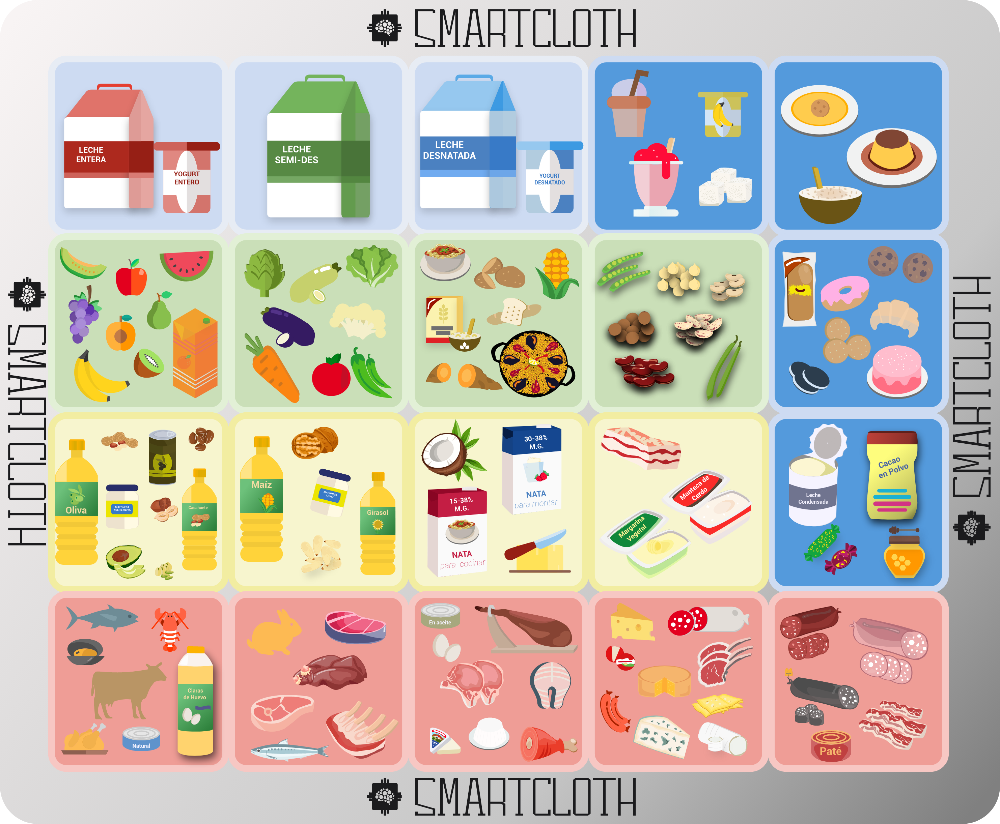
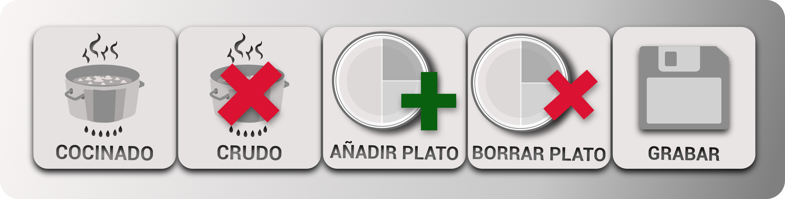

## Descripción del Proyecto

SmartCloth es un dispositivo inteligente diseñado para ayudar a los usuarios a realizar un seguimiento de su ingesta alimentaria y obtener información nutricional detallada. Este proyecto incluye tanto el hardware como el software necesarios para utilizar SmartCloth de manera efectiva.

## Características Principales

- **Seguimiento Nutricional:** SmartCloth utiliza sensores integrados para pesar los alimentos y calcular su valor nutricional.
- **Conectividad Wi-Fi:** El dispositivo puede conectarse a Internet para almacenar datos en la nube y acceder a información actualizada sobre alimentos.
- **Interfaz de Usuario Intuitiva:** La interfaz de usuario proporciona una experiencia fácil de usar para los usuarios, con opciones claras y accesibles.

## Interfaz de Usuario

### Dashboard

### Botonera de Grupos de Alimentos

### Botonera de Acciones

## Contacto

Para obtener más información, visite nuestro sitio web oficial en [smartcloth.org](https://smartcloth.org).
