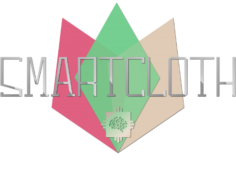
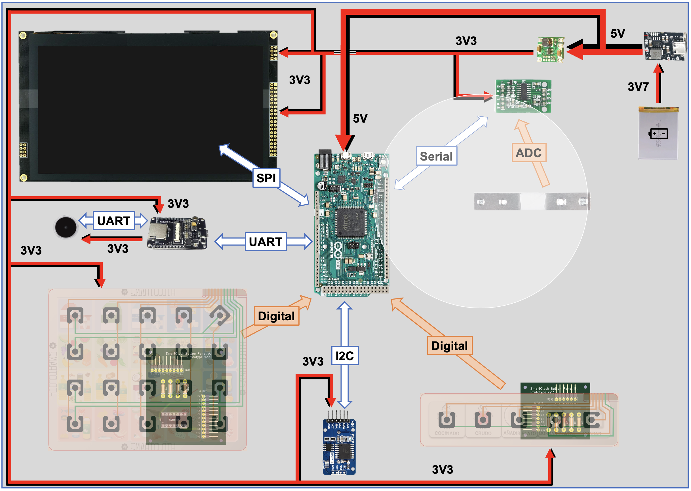
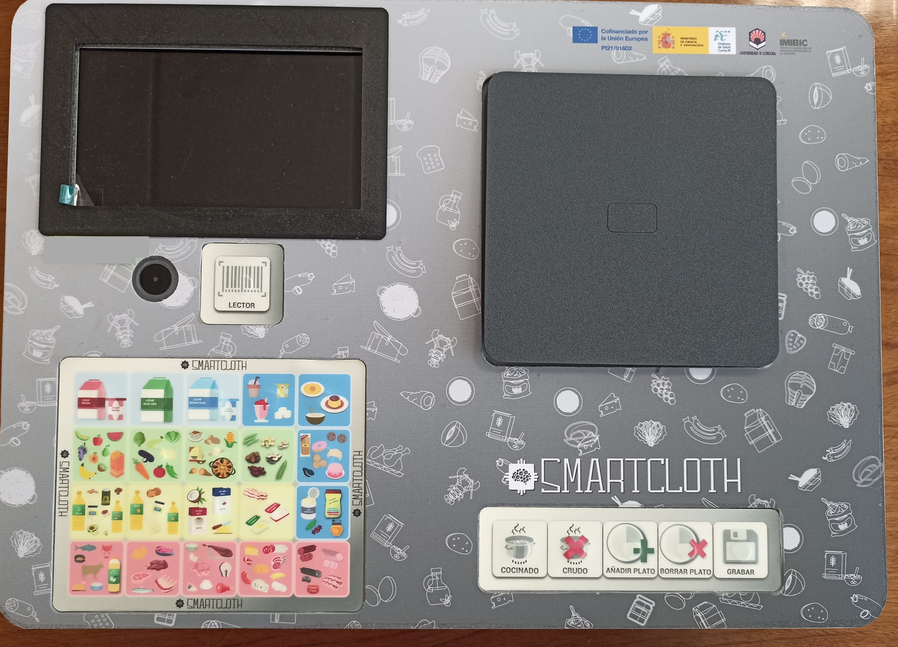

# SmartCloth

Dispositivo inteligente orientado a personas diabéticas para registrar la ingesta alimentaria y consultar información nutricional.  
El proyecto abarca tanto el diseño hardware como el desarrollo software necesarios para su funcionamiento.

---

# SmartCloth 1.x
## Características Principales 
- **Seguimiento Nutricional:** SmartCloth utiliza sensores integrados para pesar los alimentos y calcular su valor nutricional.
- **Interfaz de Usuario Intuitiva:** La interfaz de usuario proporciona una experiencia fácil de usar para los usuarios, con opciones claras y accesibles.

## Comunicaciones

## Interfaz de Usuario
### Dashboard

### Botonera de Grupos de Alimentos

### Botonera de Acciones

## Aspecto externo

---

# SmartCloth 2.x
## Características adicionales
- **Lectura de códigos de barras:** Utiliza un lector de códigos de barras para procesar alimentos precocinados o envasados.
- **Conectividad Wi-Fi:** El dispositivo puede conectarse a Internet para almacenar información de las comidas en la base de datos y acceder a información actualizada sobre productos comerciales.

## Comunicaciones 

## Aspecto externo v2.0

## Aspecto externo v2.1

---

## Montaje del Hardware
Para ensamblar el hardware de SmartCloth 2.1, por favor consulte el [documento de montaje](./Docs/SmartCloth%20assembly%20document%20V0.2.pdf).

## Programación del dispositivo
1. Guardar imágenes en SD ([contenido_SD](v2.1%20-%20src/contenido_SD)) manteniendo la estructura de ficheros
2. Poner RTC en hora (programa [RTC_set_time](./v2.1%20-%20src/RTC/RTC_set_time/RTC_set_time.ino))
3. Calibrar báscula (programa [calibrate_scale](./v2.1%20-%20src/calibrate_scale/calibrate_scale.ino)) 
   1. Poner peso conocido
   2. 𝑒𝑠𝑐𝑎𝑙𝑎 𝑖𝑛𝑖𝑐𝑖𝑎𝑙 ∗ 𝑔𝑟 𝑜𝑏𝑡𝑒𝑛𝑖𝑑𝑜𝑠 𝑎𝑙 𝑝𝑒𝑠𝑎𝑟 = 𝑋
   3. 𝑋/30 𝑔𝑟 = 𝑛𝑢𝑒𝑣𝑎 𝑒𝑠𝑐𝑎𝑙𝑎 (𝑏𝑎𝑠𝑐𝑢𝑙𝑎 𝑐𝑎𝑙𝑖𝑏𝑟𝑎𝑑𝑎)
   4. Modificar programa Arduino con nueva escala calculada ([scale.set_scale(escala)](https://github.com/i62caroi/SmartCloth/blob/main/v2.1%20-%20src/smartcloth_v2/Scale.h#L87) en la función [setupScale()](https://github.com/i62caroi/SmartCloth/blob/main/v2.1%20-%20src/smartcloth_v2/Scale.h#L68)) del programa del Arduino
4. Programar Arduino ([smartcloth_v2](v2.1%20-%20src/smartcloth_v2/smartcloth_v2.ino))
5. Programar ESP32 ([esp32cam-v1](v2.1%20-%20src/esp32cam-v1/esp32cam-v1.ino)) y añadir MAC del ESP32 a la database

---

# Acerca del proyecto

Este sistema se desarrolla en el marco del proyecto de investigación **“SMARTCLOTH. Diseño, implementación y estudio de la eficacia y usabilidad de un mantel digital para la autogestión de la dieta en pacientes diabéticos”**, financiado por el Instituto de Salud Carlos III.  
El proyecto está liderado por el grupo **GA-16 Estilos de Vida, Innovación y Salud** del Instituto Maimónides de Investigación Biomédica de Córdoba (IMIBIC).  

Para obtener más información, visita nuestro sitio web oficial en [smartcloth.org](https://smartcloth.org).

---

# Historial de releases

| Versión   | Fecha       | Descripción |
|-----------|-------------|-------------|
| ✅ v1.0.0  | 18-07-2023  | Primera versión funcional. Incluye pesaje, selección de grupo, estado de cocción, almacenamiento local en CSV. Validada con usuarios en julio 2023. |
| 🔧 v1.0.1  | 21-09-2023  | Mejoras tras las pruebas: mensajes, lógica de errores, ajustes de interfaz. |
| 🌐 v2.0.0  | 29-04-2024  | Integración del ESP32: conexión WiFi, sincronización con base de datos, nuevo protocolo de comunicación Due-ESP32. |
| 📷 v2.1.0  | 12-07-2024  | Sistema completo con lector de códigos de barras, búsqueda en OpenFoodFacts, pantallas de sincronización. Validada con usuarios en julio 2024. |
| 🛠 v2.1.1  | 09-10-2024  | Ajustes tras las pruebas: validación de códigos de barras, feedback visual, soporte del plato, mejora comunicación Due-ESP32. |
| 💾 v2.1.2  | 23-01-2025  | Mejora de usabilidad: almacenamiento local de productos escaneados (caché de productos recurrentes). |
| 🔁 v2.1.3  | 24-04-2025  | Refuerzo de lógica de interacción: detección de retirada sin aviso y flujo alternativo. |
| 📚 v2.1.4  | 25-06-2025  | Reorganización del repositorio y mejora de documentación. |

> ✅ Las versiones `v1.0.0` y `v2.1.0` corresponden a las iteraciones validadas mediante pruebas reales con usuarios.
